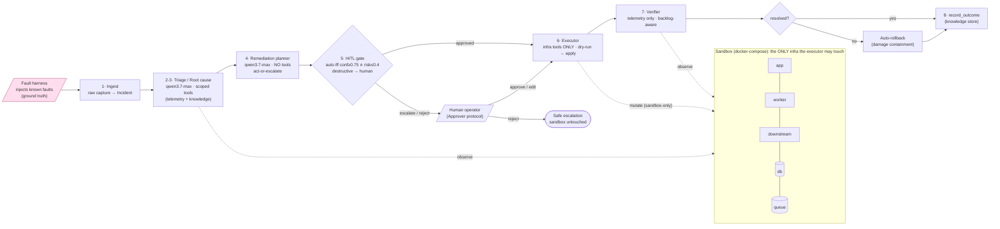

# Architecture

The implemented system: an eight-stage incident-to-resolution loop with a
human-in-the-loop gate, benchmarked against a single-prompt baseline on a
fault-injection harness with known ground truth.

> A static export of this diagram is at [architecture.svg](architecture.svg)
> (viewable outside a Mermaid renderer). GitHub renders the Mermaid block above
> natively.

## Stage contracts (Pydantic at every boundary)

| Stage | In → Out | Model tier | Tools (exposure.py) |
|---|---|---|---|
| ingest | raw capture → `Incident` | none | none |
| triage / root-cause | `Incident` → `TriageResult` (ranked hypotheses + cited evidence + telemetry summary) | **reasoning** (qwen3.7-max) | telemetry + knowledge |
| plan | `TriageResult` → `RemediationProposal` (steps, rollback, risk, blast radius, `escalate`) | **planning** (qwen3.7-max) | **none** (evidence flows forward from triage) |
| HITL gate | proposal → `GateOutcome` | none | none (Approver protocol) |
| execute | approved proposal → `ExecutionResult` | none | infra/ops only |
| verify | (none) → `VerificationResult` | none | telemetry only |

Two contracts worth naming explicitly:

- **Triage gathers, deterministically.** Before its single reasoning-tier call,
  triage queries its scoped tools in plain code (zero LLM tokens): live log
  groups and a fresh metric window (current state can carry decisive detail the
  alert-time capture missed, as in the `db_outage_ambiguous` benchmark fault), an
  alert re-check, then runbook/past-incident retrieval keyed on the combined
  symptoms. There is no agentic tool loop on the max-tier model.
- **Planner handoff.** The planner is structurally toolless, so its prompt must
  carry the evidence: the summarized telemetry triage reasoned over
  (`TriageResult.telemetry_summary`) comes FIRST, the hypothesis second, and
  retrieved runbooks last, explicitly labeled as approximate reference material.
  The first benchmark lost exactly by starving the planner (see `REPORT.md`); the
  fix was the handoff, not tool access. The mutating-tool rule stays absolute:
  **only the executor may call Infra/Ops tools.**

## Safety model

- **Sandbox-only, structurally:** closed-enum service targets + server-side
  namespace/target injection in the MCP layer; no model-facing field can name a
  foreign target (detail below).
- **HITL routing:** auto-approve iff remediation confidence ≥ 0.75 AND risk ≤ 0.4;
  destructive actions (`apply_config`, `scale_service`, classified server-side)
  always escalate, and a 0.6 risk floor overrides model-claimed risk. The planner
  may also `escalate` (decline to act) when no in-vocabulary fix exists.
- **Approval is a capability:** proposals are born `requires_approval=True`; only
  the gate clears it and the executor refuses anything still flagged.
- **Execution discipline:** per step dry-run → apply, halt on failure; failed
  verification triggers the rollback plan automatically (containment).
- **Cost discipline:** telemetry summarized before any prompt; structured-output
  retries bounded by attempts AND tokens; every call metered per step with
  free-tier/voucher attribution; a per-run token cap can hard-stop a runaway.

## Design decisions

### Sandbox-only by construction (not by validation)

The hard guarantee is that the agent **cannot express an out-of-sandbox action**,
so there is nothing to validate away at runtime:

| What | How it is bound | Why the model can't escape it |
|---|---|---|
| Compose namespace / project | `SandboxController` bound at server build time; echoed read-only as `OpResult.namespace` | no model-facing field exists for it |
| Service target | closed `Literal` enum (`app`/`worker`/`downstream`/`db`/`queue`), test-synced to `docker-compose.yml` | out-of-enum dies at schema validation; runtime guard re-checks direct calls |
| Config-tool target (`app`) & active incident id | fixed in the tool body / injected from `RunContext` | not model params; a spoofed `incident_id` arg is ignored |

The model decides *which action and which sandbox service*, never *what foreign
thing to point at*. The benchmark records **0 invalid (out-of-sandbox) tool
calls** across all 8 scenarios, and the deployed backend mounts **no Docker
socket**, so even a compromised API process has no path to the host. Adversarial
targets (`prod-db`, `/var/run/docker.sock`, `../host`, shell-injection strings)
are rejected at the enum and unit-tested (`test_mcp_servers.py`,
`test_deploy_smoke.py::test_executor_sandbox_guard_holds`).

### Deliberate tooling posture: lean, not a gateway

At **3 local stdio servers / ~12 tools / one agent on a 1M-context model**, the
failure modes that justify heavy MCP infrastructure don't apply: twelve schemas
are negligible in a 1M-token window, so **schema bloat** and **tool-selection
collapse** are non-problems. Three deliberate choices follow:

- **Stage-scoped tool exposure** (`exposure.py`): each stage gets the minimal
  server subset (`triage`/`root_cause` → telemetry+knowledge; `planner` → none;
  `executor` → infra; `verification` → telemetry). Unknown stages raise; the
  default is no tools. A stage that can't see a tool can't call it.
- **Server-side parameter injection** (above): the mechanism behind the
  structural sandbox guarantee, and it costs zero prompt/output tokens.
- **Output summarization**: telemetry tools return deduplicated log groups and
  windowed metric deltas, never raw dumps, bounded before any prompt
  (ablation: **43.8%** real-token saving vs raw context).

The heavier patterns are **scaling paths for future work**, not gaps:

| Pattern | Pays off at | Why not at this scale |
|---|---|---|
| MCP **gateway / router** | many servers + consumers, cross-cutting auth/routing | nothing to route (one consumer, three local servers); an extra process/hop to test and audit |
| **Dynamic tool discovery / search** | hundreds of tools that can't fit a prompt | 12 schemas fit cheaply; the static stage map is *stricter*: it removes tools rather than helping find more |
| **Code-execution mode** | very high tool fan-out / composition-heavy flows | adds a second execution surface to sandbox separately, undermining the single hard guarantee (every action is an enumerated, typed, HITL-gated, audit-logged tool call) |

Full rationale and per-tool schemas: [mcp.md](mcp.md). Benchmark methodology and
results vs the single-prompt baseline: [../REPORT-real-v2.md](../REPORT-real-v2.md).
